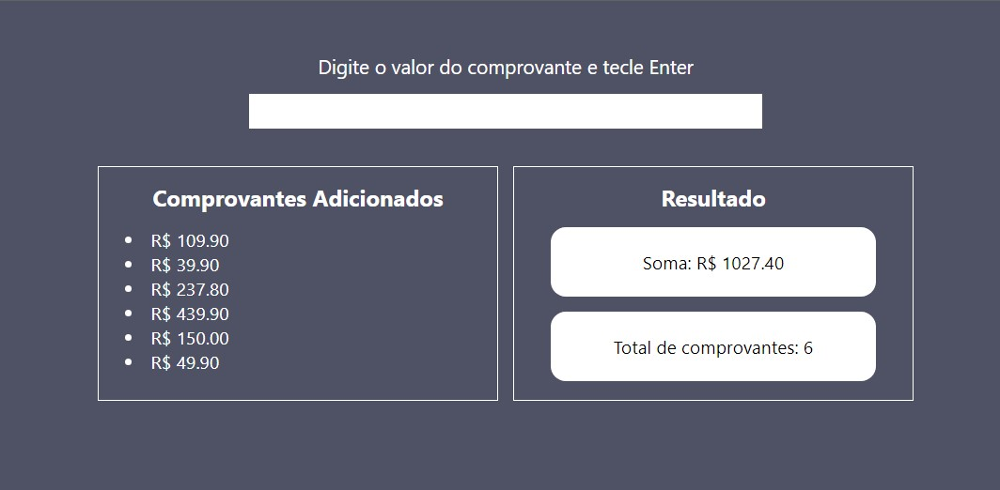

# Calculadora para Fechamento de Caixa

Esse projeto nasceu de uma situação real, dentro da rotina de uma loja de comércio varejista.

Ao fechar o caixa, os responsáveis pelo fechamento precisavam seguir os seguintes passos:

1. Separar os comprovantes dos cartões por bandeiras: Mastercard, Redecard (Mastercard na função débito), Visa crédito, Visa Electron (Visa na função débito) e etc.
2. Somar os valores dos comprovantes dos grupos acima: Valor total dos comprovantes Mastercard, Redecard, Visa Crédito, Visa Electron e etc.
3. Contar quantos comprovantes cada bandeira possui: Mastercard (somatório: R$ 4.000,00 | número de comprovantes: 8) e etc.
4. Em caso de dúvida em relação aos resultados (soma dos valores e/ou número de comprovantes), repetir os passos 2 e/ou 3.

Ao desenvolver esse programa, meu objetivo foi simplificar o procedimento, que na prática passou a ter somente dois passos:

1. Separar os comprovantes por bandeiras;
2. Digitar os valores.

E pronto!

O programa irá calcular a soma dos valores e quantos comprovantes foram digitados e, além disso, em caso de dúvida em relação ao resultado, os comprovantes adicionados aparecem em forma de lista, para que seja possível fazer uma rápida e prática conferência visual, evitando contar tudo novamente somente para checar se os valores estão corretos.

O projeto concluído ficou assim:

***

Sobre a parte técnica do programa, ele está separado em três partes:

1. HTML: Basicamente, criei um input para receber os valores e duas divs, uma para exibir os comprovantes adicionados e outra para exibir os resultados (somatório dos valores e a contagem dos comprovantes digitados).

2. CSS: Trabalhei com Flexbox e deixei a página com layout responsivo.

3. JavaScript: De forma bem resumida, trabalhei com array, funcões, *control flow* (condicionais e loops) e a interação entre JavaScript e HTML.

